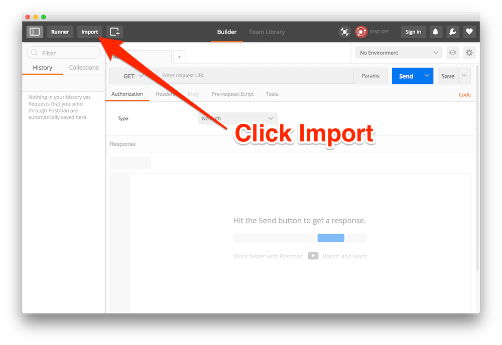
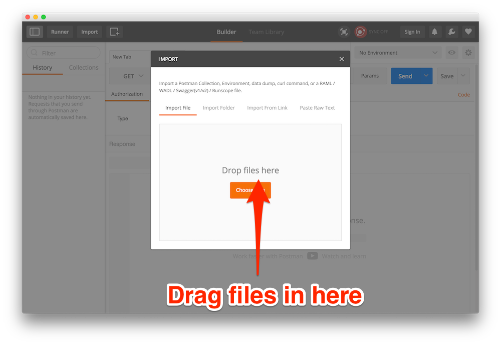
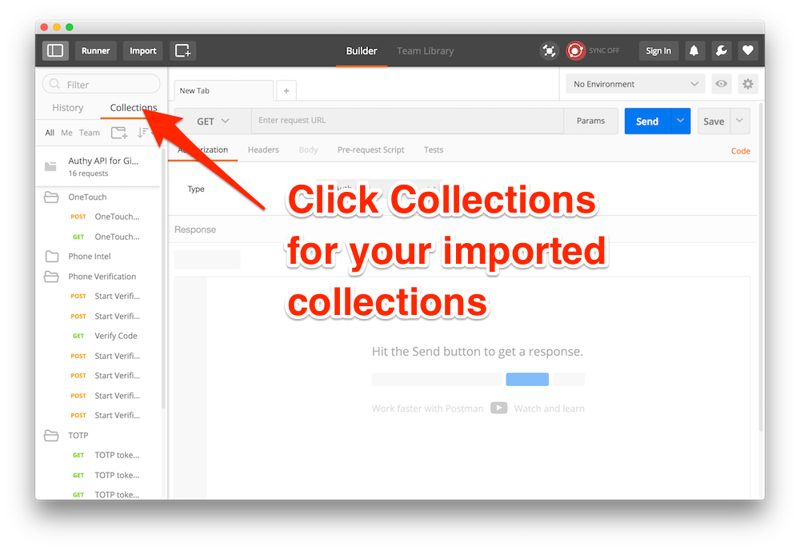
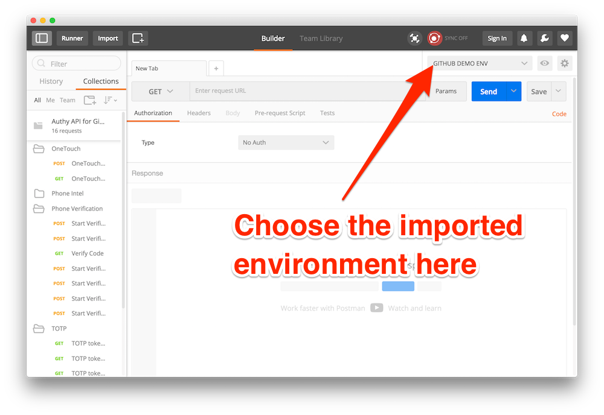
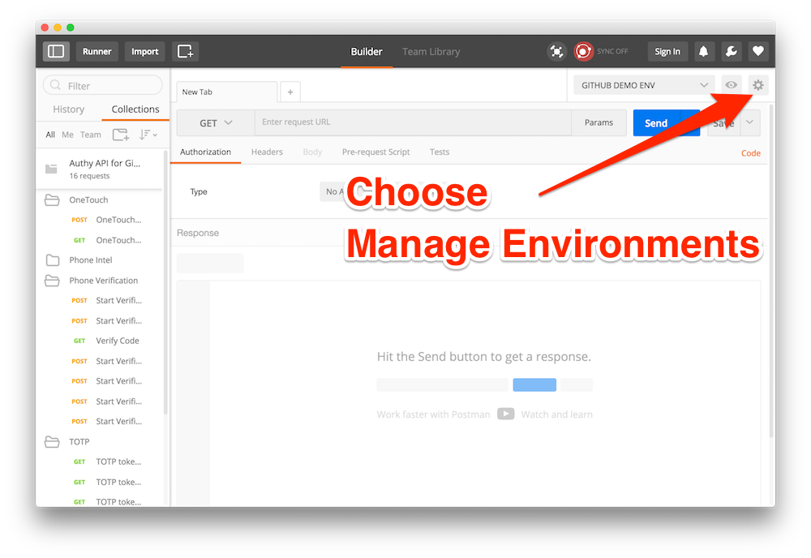
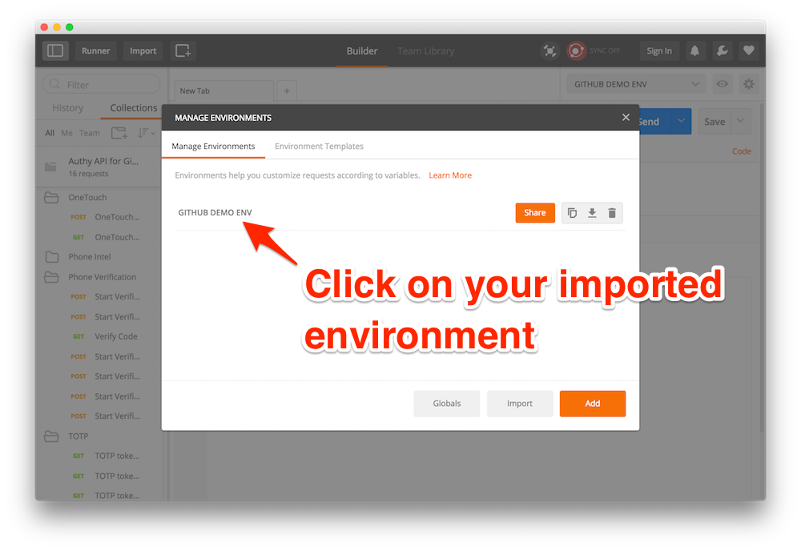
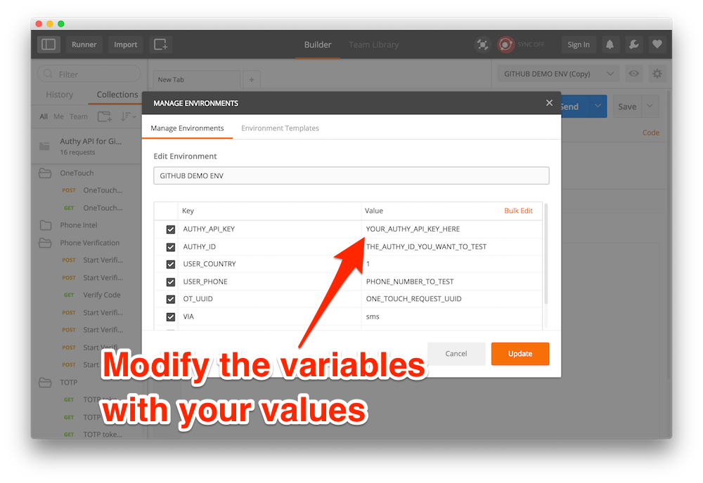
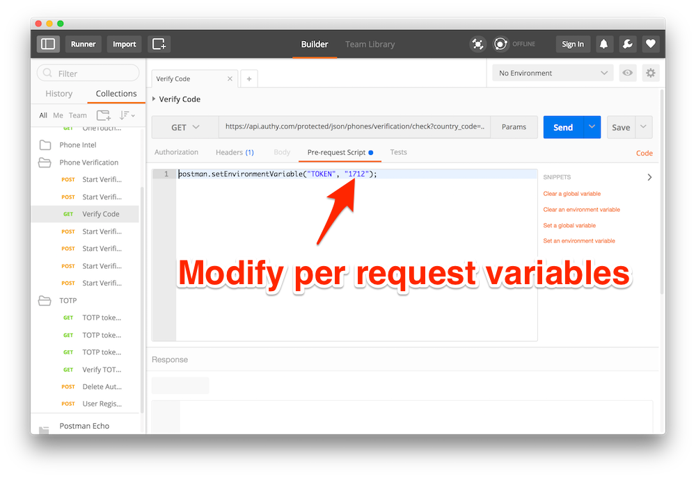

# Postman Collection Setup Instructions

The Postman collection and enviroment help you to test the Authy APIs in a very easy fashion. In order to install them simply follow the following steps:

### 1. Download the files

Download the following two files:
- [Environment file](GITHUB%2520DEMO%2520ENV.postman_environment.json)
- [Collection](Authy%2520API%2520for%2520Github.postman_collection.json)

### 2. Open `Import` dialog

### 3. Choose the two files

Either drag the two files that you downloaded into this window or choose them in the file chooser.

### 4. Verify imported collection

You should be able to verify that you have the collection imported by clicking on the collections tab on the left. This is where you can choose the different saved requests you want to do.

### 5. Choose the right environment

Choose the imported environment to ensure that the right variables are passed to every request saved in the collection.

### 6. Modify your environment

You need to modify the saved environment variables to make sure they use your keys instead of the default ones.

### 7. Modify per request variables

For some requests you will have to modify per request variables (like verifying a token). You can do this by choosing modifying the code in the `Pre-request Script`.

